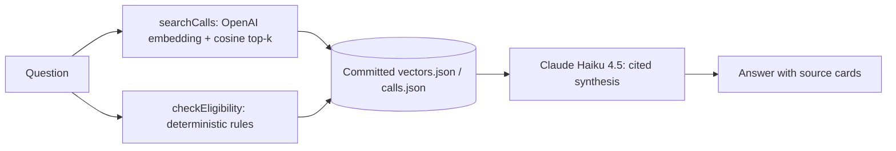

# Grant Scout

**EU funding answers with a visible evidence trail.** Grant Scout is a deliberately small Next.js agent demo: it searches a curated 30-record funding snapshot, runs deterministic eligibility checks, streams its tool activity, and cites the official source behind every funding claim.

> **Live demo:** deployment pending. This repository is an illustrative portfolio project, not a live funding catalogue or funding advice.

Grant Scout turns lessons from the earlier [EuFund prototype and case study](https://github.com/Bogdan0708/EuFund) into one standalone codebase a hiring engineer can read in an hour. EuFund is not currently live; Grant Scout does not claim to be its production service. It is designed to make three things inspectable: TypeScript application depth, agent/RAG control, and behavioral evaluation.

## What the agent does

```text
question
   │
   ├── searchCalls ── OpenAI query embedding ── cosine top-k over committed vectors
   │                                                │
   ├── checkEligibility ── deterministic rules      │ 30 curated records
   │                                                │ official source URLs
   └── Claude Haiku 4.5 ── cited synthesis ◀────────┘
```



- `searchCalls` embeds the question with `text-embedding-3-small`, then searches `data/vectors.json` in memory. There is no vector database.
- `checkEligibility` evaluates applicant type, geography, and consortium setup as code. It returns `likely`, `unclear`, or `unlikely` with individual checks.
- The system prompt forbids funding facts before retrieval and forbids citations to records that were not retrieved.
- The UI shows tool invocations and returned source cards. It does **not** expose private model chain-of-thought.
- Empty retrieval is a supported outcome: the agent must say there is no matching call in this snapshot.

## Why this shape

| Decision | Reason |
|---|---|
| JSON corpus and committed vectors | A 30-record demo does not need a database, queue, or vector service. The evidence is reviewable in Git. |
| Runtime query embedding | Committed document vectors still need a query vector in the same embedding space. This requires `OPENAI_API_KEY` at runtime as well as during the build-time embedding step. |
| Deterministic eligibility tool | Country, applicant, and partnership checks should be testable code rather than model improvisation. |
| Claude Haiku 4.5 for synthesis | Low-cost tool use and an on-brand Claude integration for the target applied-AI roles. The model is configurable. |
| One Cloud Run instance | Keeps the in-memory abuse counters coherent while preserving scale-to-zero. This is a demo trade-off, not a production rate-limit design. |
| Explicit snapshot language | Programme pages and work programmes change. Every card links to its official source and avoids invented live deadlines. |

## Project map

```text
app/                    Next.js App Router UI and guarded streaming route
components/             useChat interface and visible tool/source rendering
data/calls.json         30-record illustrative snapshot dated 2026-08-29
data/vectors.json       committed text-embedding-3-small vectors
lib/agent.ts            evidence contract, tools, model orchestration
lib/retrieval.ts        index validation and cosine top-k
lib/eligibility.ts      deterministic pre-screen rules
lib/rate-limit.ts       per-IP and daily demo limits
evals/                  15 golden cases and LLM-as-judge runner
tests/                  retrieval, eligibility, corpus, and limiter units
```

## Run locally

Requires Node.js 22+ and Anthropic/OpenAI API keys.

```bash
npm ci
cp .env.example .env.local
# Add ANTHROPIC_API_KEY and OPENAI_API_KEY
npm run dev
```

Open <http://localhost:3000>. The health endpoint is `/api/health`.

Useful commands:

```bash
npm run typecheck
npm run lint
npm test
npm run build
npm run embed       # rebuild committed vectors after editing data/calls.json
npm run eval        # live 15-case behavioral evaluation
npm run eval -- --write-readme
```

Tests: `npm test` (11 unit tests) · `npm run eval` (15-case behavioural eval, historical 97.5% on 2026-08-30; not run in CI without provider keys)

## Evaluation method

Each golden case exercises the real agent and scores four independent properties:

- **Tool contract (25%)** — required tools were called.
- **Retrieval target (25%)** — at least one accepted record was retrieved, or the empty-result behavior fired.
- **Citation validity (20%)** — answer citations exist and are a subset of retrieved IDs.
- **Faithfulness (30%)** — a separate low-temperature LLM judge checks every factual funding claim against the retrieved structured evidence.

The overall gate defaults to 75%. `evals/results/latest.json` is generated locally and retained as a CI artifact; the main-branch evaluation workflow refreshes this table. Fork pull requests never receive model secrets.

<!-- EVAL_RESULTS_START -->
_Last credentialed run: 2026-08-30T08:28:17.807Z_

| Case | Score | Tools | Retrieval | Citations | Faithfulness |
|---|---:|:---:|:---:|:---:|---:|
| romanian-govtech-sme | 98.5% | ✓ | ✓ | ✓ | 95% |
| deeptech-startup | 98.5% | ✓ | ✓ | ✓ | 95% |
| climate-city | 100.0% | ✓ | ✓ | ✓ | 100% |
| uk-horizon-university | 98.5% | ✓ | ✓ | ✓ | 95% |
| regional-policy | 98.5% | ✓ | ✓ | ✓ | 95% |
| film-distribution | 100.0% | ✓ | ✓ | ✓ | 100% |
| health-data | 98.5% | ✓ | ✓ | ✓ | 95% |
| transport-infrastructure | 100.0% | ✓ | ✓ | ✓ | 100% |
| net-zero-factory | 75.0% | ✗ | ✓ | ✓ | 100% |
| advanced-ai-skills | 98.5% | ✓ | ✓ | ✓ | 95% |
| circular-sme | 98.5% | ✓ | ✓ | ✓ | 95% |
| postdoc-mobility | 100.0% | ✓ | ✓ | ✓ | 100% |
| sme-international-rd | 98.5% | ✓ | ✓ | ✓ | 95% |
| single-applicant-pathfinder | 100.0% | ✓ | ✓ | ✓ | 100% |
| no-match-consumer | 100.0% | ✓ | ✓ | ✓ | 100% |
| **Overall** | **97.5%** |  |  |  |  |
<!-- EVAL_RESULTS_END -->

## Corpus methodology and limits

`data/calls.json` is a hand-curated programme/opportunity snapshot, accessed on 29 August 2026. Entries cover Horizon Europe, EIC, Digital Europe, LIFE, ERDF, Interreg, the European Urban Initiative, CEF, the Innovation Fund, EU4Health, Creative Europe, Erasmus+, MSCA, and Eurostars.

The corpus intentionally stores cautious programme-level deadline labels when a specific open topic is not represented. It is not scraped, not refreshed automatically, and not suitable for application decisions without reading the linked call document. `scripts/embed.ts` hashes the corpus into the vector manifest so reviewers can see when embeddings are stale.

## Abuse, cost, and failure behavior

- Requests are capped per IP and by a process-local UTC-day budget before either provider is called.
- Request bodies, history length, output tokens, agent steps, provider retries, and provider timeouts are bounded.
- Cloud Run is configured for scale-to-zero and one maximum instance.
- Provider or quota failures produce a short user-facing error; keys and prompt bodies are not logged.
- `429` responses include `Retry-After`; malformed or oversized inputs fail before model use.

The counters reset on cold start and are therefore an honest demo safeguard, not distributed enforcement. A production version would put rate state and a hard provider budget in shared infrastructure.

## Deployment

The included `Dockerfile` uses Next.js standalone output. `cloudbuild.yaml` builds to Artifact Registry and deploys `grant-scout` with:

- `min-instances=0`, `max-instances=1`
- `ANTHROPIC_API_KEY` and `OPENAI_API_KEY` mounted from Secret Manager
- public unauthenticated access
- the service account named by `_SERVICE_ACCOUNT`

Before the first build, choose the project that should own this standalone demo, then create the Artifact Registry repository and a least-privilege runtime service account with access only to those two secrets. Do not assume the retired EuFund deployment project is the correct owner. Then:

```bash
gcloud builds submit \
  --project="$GCP_PROJECT" \
  --config=cloudbuild.yaml \
  --substitutions=_REGION=europe-west1,_REPOSITORY=demos,_SERVICE=grant-scout,_SERVICE_ACCOUNT="grant-scout-runtime@${GCP_PROJECT}.iam.gserviceaccount.com"
```

Do not grant the public service account access to the existing application database or unrelated `fondeu-platform` secrets.

## CI

- `ci.yml` runs typecheck, lint, unit tests, and a production build without provider credentials on pushes and pull requests.
- `eval.yml` runs only after a push to `main`, receives repository secrets, writes the score table above, uploads the machine-readable result, and commits a `[skip ci]` README refresh.

## Author

**Vasile Bogdan Godja** — founder-operator of Salt & Standard, the currently live automation agency. EuFund and PrimarIA are earlier case studies, not live services.

## License

[MIT](LICENSE)

## Reproducing a credentialed evaluation

`npm run eval` runs the 15 cases with real Anthropic generation/judging and OpenAI
query embeddings. It requires both provider keys and incurs provider usage. The
GitHub workflow is manually dispatched and **fails** if either key is missing;
a successful unit-test workflow is not a successful behavioral evaluation.
Results record source commit, dirty-tree status, corpus/vector/case hashes, model
identifiers, per-case latency, generation/judge token usage and full tool/citation
traces. Total billing cost is not inferred from incomplete token accounting.

The workflow uploads results as an artifact and does not silently rewrite the
README. Historical results remain historical until a new artifact is reviewed.
